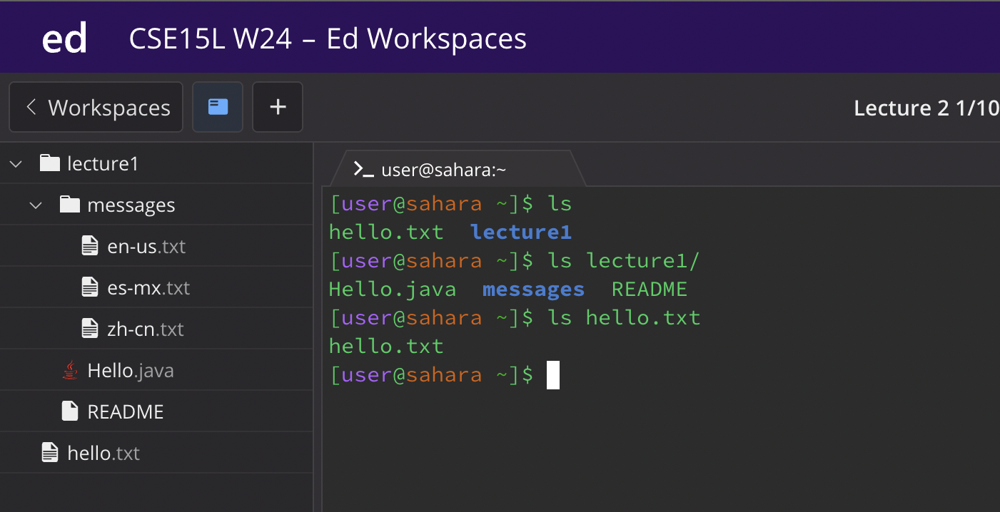
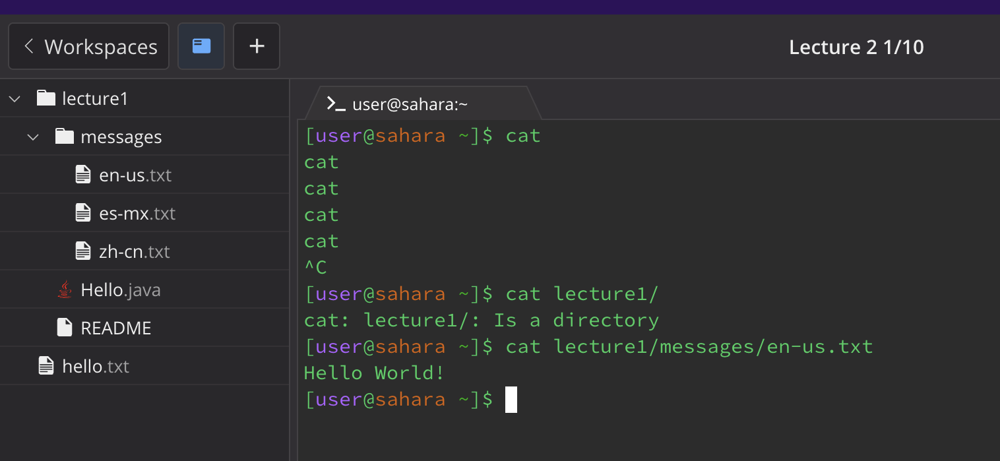

## cd
#### 1 (no arguements) : cd
this gives no output because we aren't telling it which directory we should change into so the directory is still just  /home.
#### 2 (path to directory with argument): cd lecture1/
   this gives us: [user@sahara ~/lecture1]$ that is the directory that we are currently in and it has changed into lecture1 directory from home.
#### 3(path to a file as an arguement): cd lecture1/messages/en-us.txt
this will give me    
bash: cd: messages/en-us.txt: Not a directory\
so a cd cant go into a file because its function is to change directories.

## ls
#### 1 (no arguements) : ls 
this gives me   hello.txt  lecture1  which is basically giving me a list of files I can choose from. directory is home
#### 2 ( path to a directory with argument) : ls lecture1/
this gives me Hello.java  messages  README    which tells me the available files in lecture1 but it keeps us in the directory we were in, that does not change.
#### 3 ( path to a file as an arguement) : ls lecture1/messages/en-us.txt 
this gives me lecture1/messages/en-us.txt which is the where my output took me but it still keeps ime in the /home directory

## cat
#### 1 (no arguments) : cat
makes your code go crazy and you can only get out by doing control c
#### 2 (path to a directory with argument) : cat lecture1/ 
this gives us cat: lecture1/: Is a directory and you can't concatenate a directory it must be a file.
#### 3 ( path to a file as an arguement) : [user@sahara ~]$ cat lecture1/messages/en-us.txt 
this gives us our desired out put of Hello World! just what we were looking for. but that keeps us in the home directory after.

