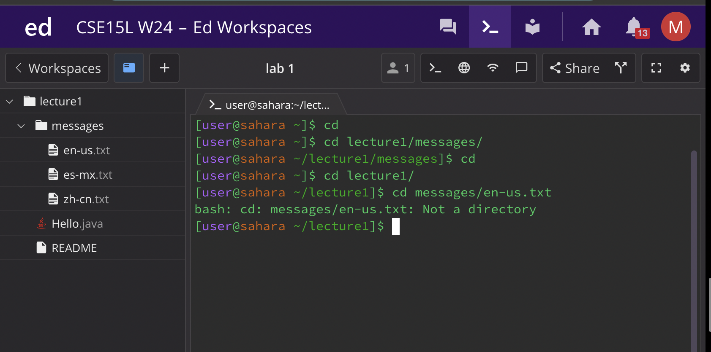
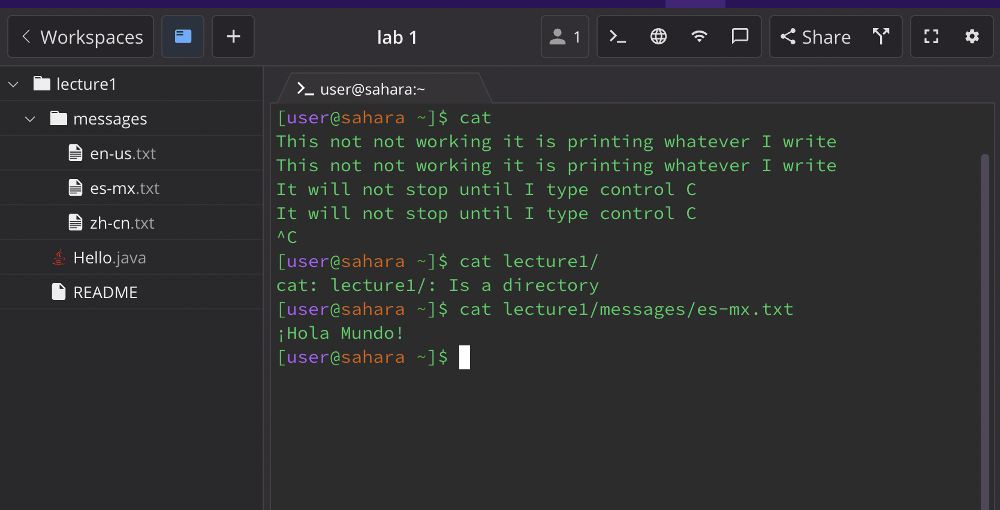

# `cd`
### 1
#### (no arguements) : `cd`
I ran `cd` twice, for the first time the working directory was `/home` and this gave me no output because i didn't give it a directory to change into. For the next time I used the `cd` command I was in the `/lecture1/messages` directory and when I used `cd` it took me back to the `/home` directory which in my experience did the same thing as `cd ..` which we were taught in lecture! The output is `not an error`.
### 2
#### (path to directory with argument): `cd lecture1/`
this command changed my directory into `/lecture1` it worked like a charm because this command is meant for us to change into different directories. The working directory when I first ran the code was `/home`. Then when I used the command it put me in `/home/lecture1`. The output was `not an error`.
### 3
#### (path to a file as an arguement): `cd messages/en-us.txt`
I was in the `lecture1` directory when I ran this and it gave me:   
`bash: cd: messages/en-us.txt: Not a directory\`
The reason why I got this output is because a `cd` cant go into a file because its function is to change directories. This result ended in an `ERROR` because `en-us.txt` is not a directory! and this kept me in the `/lecture1` directory
##### All examples of my code is in the image below!

# `ls`
### 1
#### (no arguements) : `ls` 
this gives me   `hello.txt  lecture1`  which is basically giving me a list of files I can choose from. directory is `/home` and this is `not an error`. The reason why I got this output is because ls is listing the files in the `/home` directory. my directory did not change from `/home`.
### 2
#### ( path to a directory with argument) : `ls lecture1/`
this gives me `Hello.java  messages  README` which tells me the available files in `lecture1` but it keeps us in the `/home` directory, that does not change. this is `not an error` and worked just as expected.
### 3
#### ( path to a file as an arguement) : `ls hello.txt` 
this gives me `hello.txt` which is the where my output took me but it still keeps ime in the `/home` directory. Since `hello.txt` is a file and does not have files for `ls` to list it just listed its own file name which is `hello.txt`. I used this command in the `/home` directory and stayed there. This output is `not an error`.
##### image for ls below!

# `cat`
### 1
#### (no arguments) : `cat`
makes your code go crazy and you can only get out by doing `control c`. It is rewriting everything you write and the code keeps going as you can see. I did the `cat` command while I was in the `/home` directory and I stayed in the `/home` directory. I am going to say this is `not an error` although it seems like it is. The reason I say this is because it is technically doing its job at concatenating the words I am typing. I am on the fence if this is an `error` or not I must say.
### 2
#### (path to a directory with argument) : `cat lecture1/` 
this gives us `cat: lecture1/: Is a directory` you can't concatenate a directory it must be a file. I was in the `/home` directory when I ran that code and I remained in the `/home` directory. This is an `error` it needs to read what is in the files.
### 3
#### ( path to a file as an arguement) : `[user@sahara ~]$ cat lecture1/messages/es-mx.txt`
this gives us our desired out put of `¡Hola Mundo!` just what we were looking for. but that keeps us in the `home` directory after right where we started. When the concatenate ran I was in the `/messages` directory but after it executed I was back at `/home`. This is `not an error`.
##### image for cat below!

