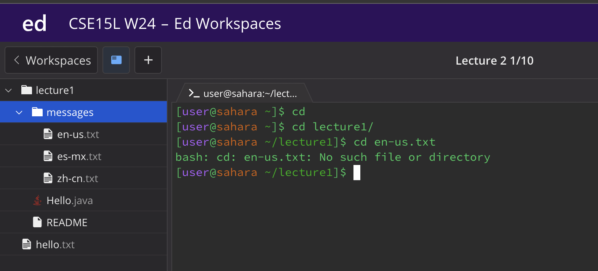

cd
1 (no arguements) : cd
this gives no output
2 (path to directory with argument): cd lecture1/
this gives us: [user@sahara ~/lecture1]$ that is the directory that we are currently in
3 (path to a file as an arguement): cd lecture1/messages/es-mx.txt
this will give me    bash: cd: lecture1/messages/es-mx.txt: Not a directory 
so a cd cant go into a file

ls
1 (no arguements) : ls 
this gives me   lecture1
2 ( path to a directory with argument) : ls lecture1/
this gives us Hello.class  Hello.java  messages  README    but it keeps us in the directory we were in
3 ( path to a file as an arguement) : ls lecture1/messages/en-us.txt 
this gives me lecture1/messages/en-us.txt which is the where my output took me but it still keeps ime in the /home directory

car
1 (no arguments) : cat
makes your code go crazy and you can only get out by doing control c
2 (path to a directory with argument) : cat lecture1/
